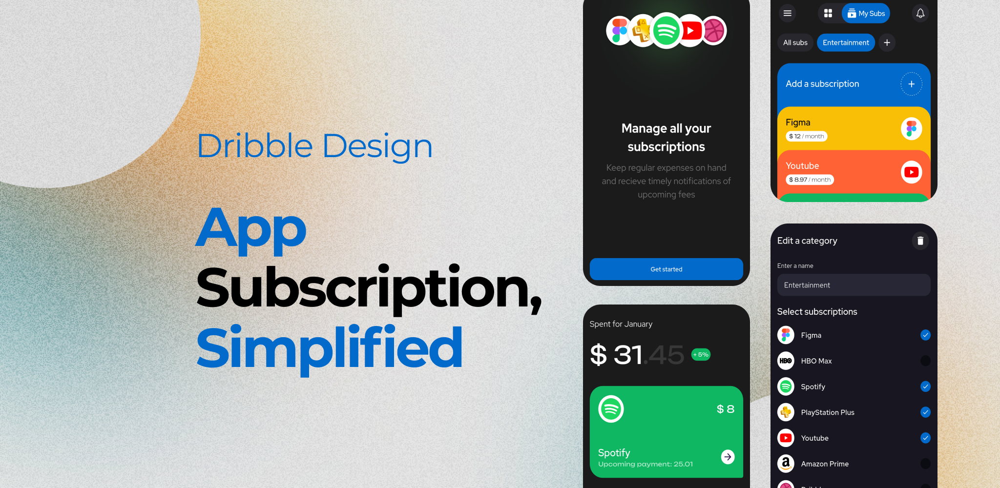
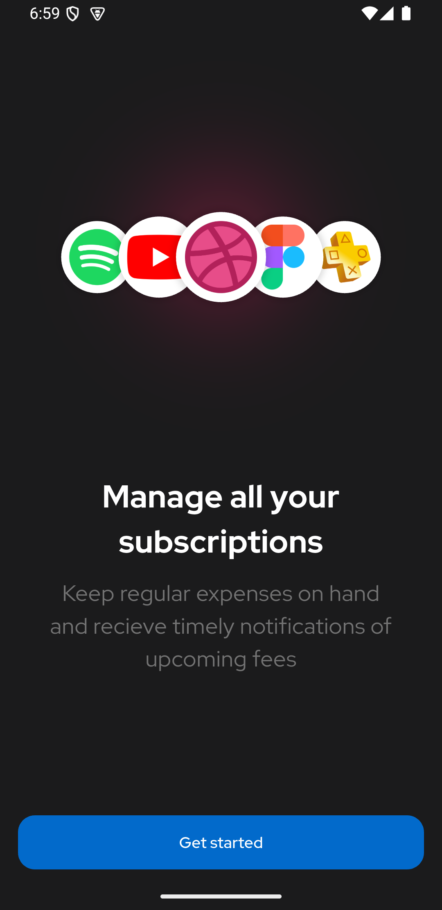
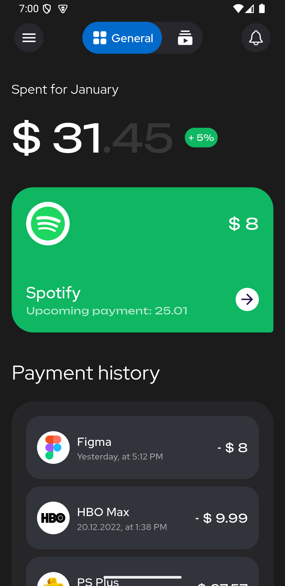
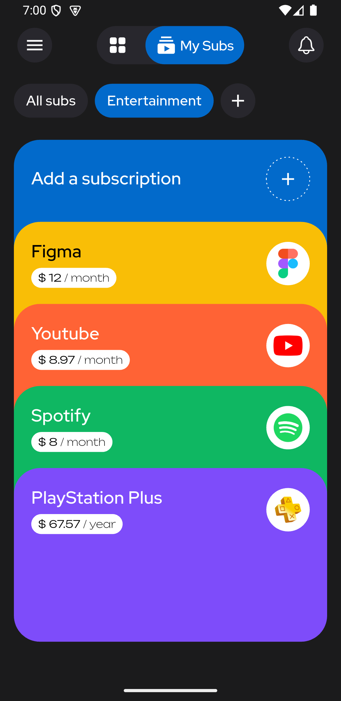
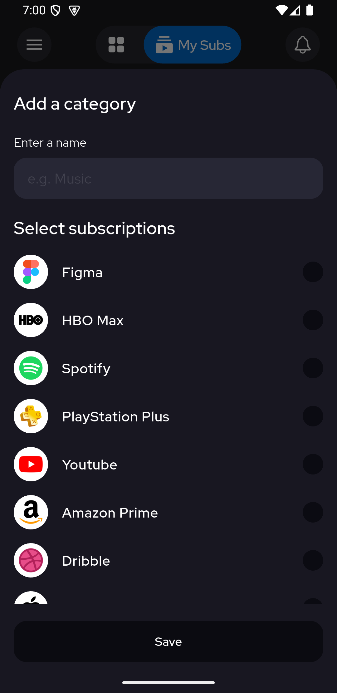

# Dribble Design

A Flutter application created using the MVVM architecture, Provider package and Hive for local Data storage.

---

## Architecture

The app uses the **MVVM (Model-View-ViewModel)** pattern:

---

## Libraries Used

- `Provider`: For state management.
- `Hive`: To store the data.
- `flutter_animate`: For animation.

---

## Modules

- **Introduction:** Introduction screen.
- **General Module:** Displays static design screen.
- **My Subscription Module:** Displays category for subscription along with apps.
- **Add Subscription Module:** Add category and subscription.

---

## Installation

1. Clone the repository.
2. Run `flutter pub get` to install dependencies.
3. Run the app using `flutter run`.

---

## Screenshots & Video

  
  

  
  

Video Preview:
https://drive.google.com/file/d/1Ak2x9TBLfuO-ehzDZHrbhG677HbgVtu7/view?usp=sharing

---

## Download APK

APK Link:
https://drive.google.com/file/d/1keP28Bh1oRLw0gAC85dRma6G1ZdBywcW/view?usp=drive_link

## License

This project is licensed under the MIT License.
